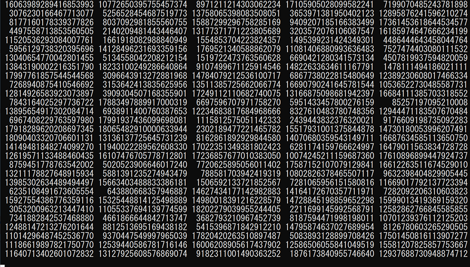

# Xoshiro-cpp <a href="https://github.com/Reputeless/Xoshiro-cpp/blob/master/LICENSE"></a> <a href="https://github.com/sponsors/Reputeless"></a>
**Xoshiro-cpp** is a header-only pseudorandom number generator library for modern C++.  
Based on **David Blackman and Sebastiano Vigna's [xoshiro/xoroshiro generators](http://prng.di.unimi.it/)**.



## Features
- Meets the **`std::uniform_random_bit_generator` concept** (C++20)
  - Works with `std::uniform_int_distribution`, `std::shuffle` and the other standard library functions
- Mostly **`constexpr`** in C++17
- Serialize / deserialize
- Utility function `double DoubleFromBits(uint64 v);`
  - Converts given uint64 value `v` into a 64-bit floating point value in the range of [0.0, 1.0)

PRNG | Output bits | Period | Footprint
--|--|--|--
SplitMix64   | 64 bits | 2^64    | 8 bytes
xoshiro256+  | 64 bits | 2^256-1 | 32 bytes
xoshiro256++ | 64 bits | 2^256-1 | 32 bytes
xoshiro256** | 64 bits | 2^256-1 | 32 bytes
xoroshiro128+  | 64 bits | 2^128-1 | 16 bytes
xoroshiro128++ | 64 bits | 2^128-1 | 16 bytes
xoroshiro128** | 64 bits | 2^128-1 | 16 bytes
xoshiro128+  | 32 bits | 2^128-1 | 16 bytes
xoshiro128++ | 32 bits | 2^128-1 | 16 bytes
xoshiro128** | 32 bits | 2^128-1 | 16 bytes

## Examples

```C++
# include <iostream>
# include "XoshiroCpp.hpp"

int main()
{
    using namespace XoshiroCpp;

    const std::uint64_t seed = 12345;

    Xoshiro256PlusPlus rng(seed);

    for (int i = 0; i < 5; ++i)
    {
        std::cout << rng() << '\n';
    }
}
```
```
10201931350592234856
3780764549115216544
1570246627180645737
3237956550421933520
4899705286669081817
```

----

```C++
# include <iostream>
# include <random>
# include "XoshiroCpp.hpp"

int main()
{
    using namespace XoshiroCpp;

    const std::uint64_t seed = 12345;

    Xoshiro256PlusPlus rng(seed);

    std::uniform_int_distribution<int> dist(1, 6);

    for (int i = 0; i < 5; ++i)
    {
        std::cout << dist(rng) << '\n';
    }
}
```
```
1
5
4
3
6
```

----

```C++
# include <algorithm>
# include <iostream>
# include "XoshiroCpp.hpp"

int main()
{
    using namespace XoshiroCpp;

    const std::uint64_t seed = 12345;

    Xoshiro256PlusPlus rng(seed);

    std::array<int, 10> ar = { 0,1,2,3,4,5,6,7,8,9 };

    std::shuffle(ar.begin(), ar.end(), rng);

    for (const auto& x : ar)
    {
        std::cout << x << '\n';
    }
}
```
```
6
3
7
2
8
5
4
9
1
0
```

----


```C++
# include <iostream>
# include "XoshiroCpp.hpp"

int main()
{
    using namespace XoshiroCpp;

    const std::uint64_t seed = 12345;

    Xoshiro256PlusPlus rng(seed);

    for (int i = 0; i < 5; ++i)
    {
        std::cout << DoubleFromBits(rng()) << '\n';
    }
}
```
```
0.553048
0.204956
0.0851232
0.17553
0.265614
```

----

```C++
# include <iostream>
# include "XoshiroCpp.hpp"

int main()
{
    using namespace XoshiroCpp;

    // This example seed sequence { 111, 222, 333, 444 } is poorly
    // distributed (has a lot of '0' bits) and it is not suitable
    // for directly use in the generator's internal state.
    // SplitMix64 PRNG can be used to increase entropy.
    const Xoshiro256Plus::state_type initialStateA =
    {
        SplitMix64{ 111 }(),
        SplitMix64{ 222 }(),
        SplitMix64{ 333 }(),
        SplitMix64{ 444 }(),
    };

    Xoshiro256PlusPlus rngA(initialStateA);

    for (int i = 0; i < 3; ++i)
    {
        std::cout << rngA() << '\n';
    }

    const Xoshiro256Plus::state_type state = rngA.serialize();

    Xoshiro256PlusPlus rngB(state);

    for (int i = 0; i < 3; ++i)
    {
        std::cout << std::boolalpha << (rngA() == rngB()) << '\n';
    }

    rngB.deserialize(initialStateA);

    for (int i = 0; i < 3; ++i)
    {
        std::cout << rngB() << '\n';
    }
}
```
```
9228892280983206813
11892737616047535485
12786908792686548306
true
true
true
9228892280983206813
11892737616047535485
12786908792686548306
```

## Roadmap

- [x] SplitMix64
- [x] xoshiro256+
- [x] xoshiro256++
- [x] xoshiro256** 
- [x] xoroshiro128+
- [x] xoroshiro128++
- [x] xoroshiro128**
- [x] xoshiro128+
- [x] xoshiro128++
- [x] xoshiro128**
- [ ] xoroshiro64*
- [ ] xoroshiro64**

## License
Xoshiro-cpp is distributed under the MIT license.
